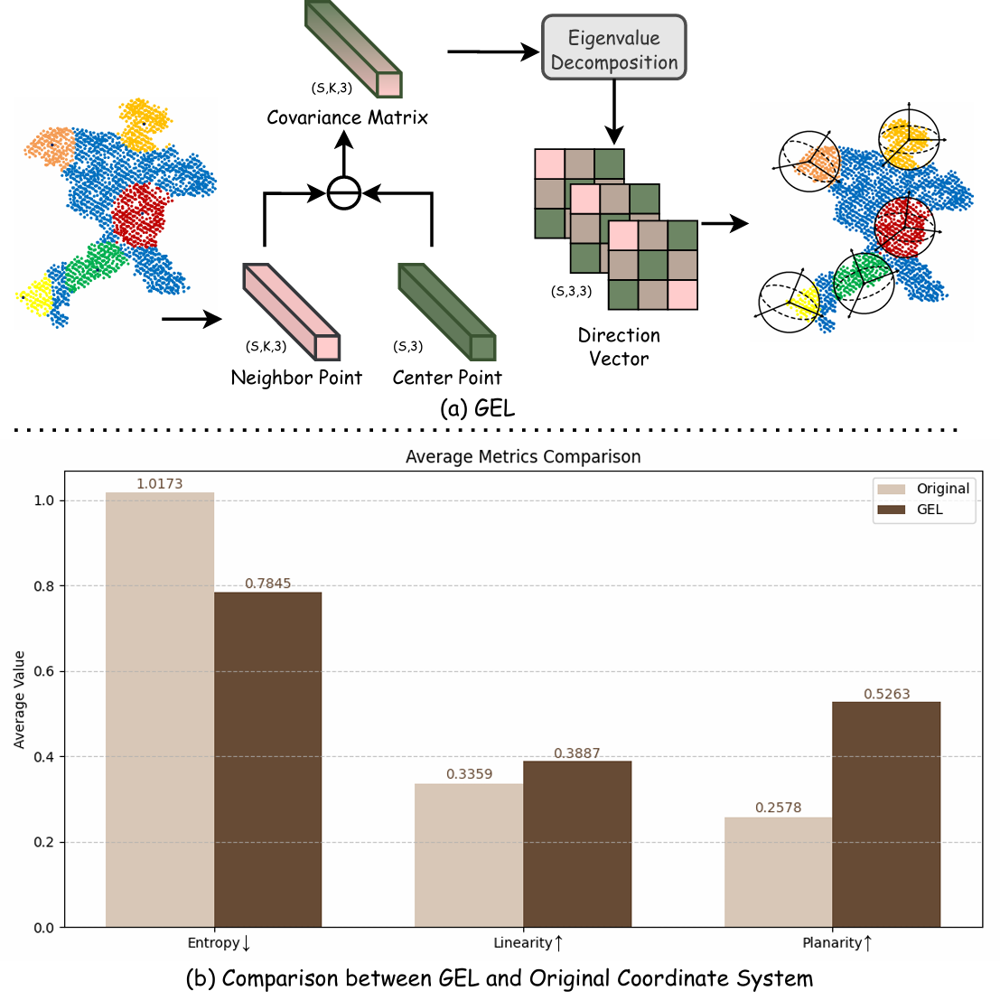
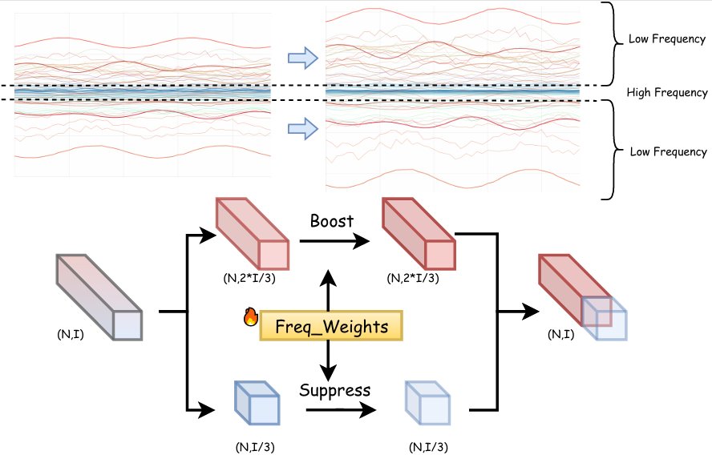
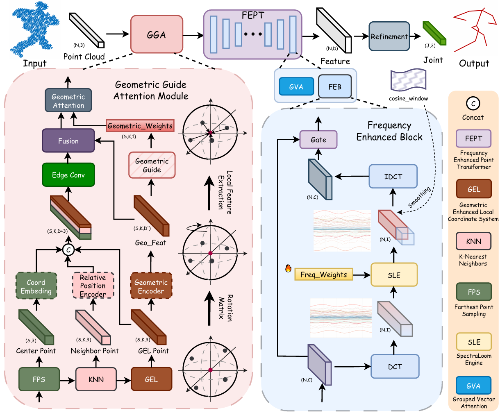

# SARL: Structure-Aware Representation Learning for 3D Human Pose Estimation from Point Clouds


## Innovation Points

<p align="center">
   
  
</p>

## Introduction

Current research on point cloud-based 3D human pose estimation faces notable challenges in effectively modeling intrinsic point correlations and fine-grained local geometric structures. In global coordinate systems, subtle joint movements are often suppressed, especially under noise interference, which hinders accurate feature extraction. To address these limitations, we propose Structure-Aware Representation Learning (SARL), a novel framework that enhances both local discriminability and global robustness. For detailed local modeling, we introduce a plug-and-play Geometric Guide Attention (GGA) module, which establishes dedicated local coordinate systems for multiple human body regions. Through geometry-guided transformations, GGA amplifies subtle pose variations and enables more accurate extraction of fine-grained local features, significantly strengthening structural correlation modeling. However, excessively fine-grained point cloud perception may amplify the influence of non-human and background noise points. To mitigate this issue, we further propose a Frequency Enhanced Point Transformer (FEPT) that incorporates Discrete Cosine Transform (DCT)-based frequency-domain modulation, selectively enhancing low-frequency human configuration signals while suppressing high-frequency noise, realizing deep fusion of noise robustness with global-local features.

### Framework




### Visualizations


## Code
Preparation:
Downloading the SMPL-X model weights from [this website](https://smpl-x.is.tue.mpg.de/) into 'smplx_models' folder.

Our data preprocessing pipeline follows [LiDAR-HMR](https://github.com/soullessrobot/LiDAR-HMR).

Installation:
```
pip install -r requirements.txt
```
Install the [Point Transformer-V2](https://github.com/Pointcept/PointTransformerV2) following their official documents.

Code:

Training:
Edit the corresponding path and variable in the training files.
SARL training:
```
python scripts/main/train.py --dataset sloper4d --cfg configs/pose_15.yaml
```
SARL testing:
```
python scripts/main/test.py --dataset sloper4d --cfg configs/pose_15.yaml --state_dict /path/to/your/file
```

## Related Projects

Our code is based on [Point Transformer-V2](https://github.com/Pointcept/PointTransformerV2), and [LiDAR-HMR](https://github.com/soullessrobot/LiDAR-HMR).

